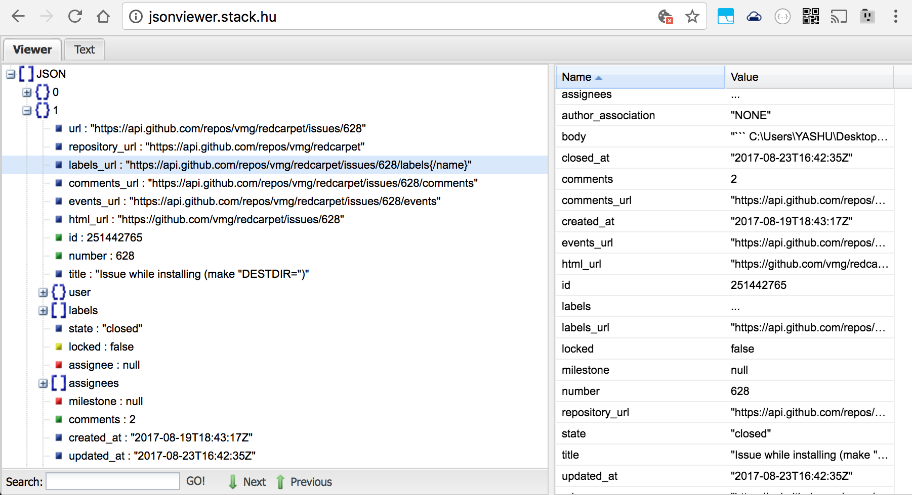
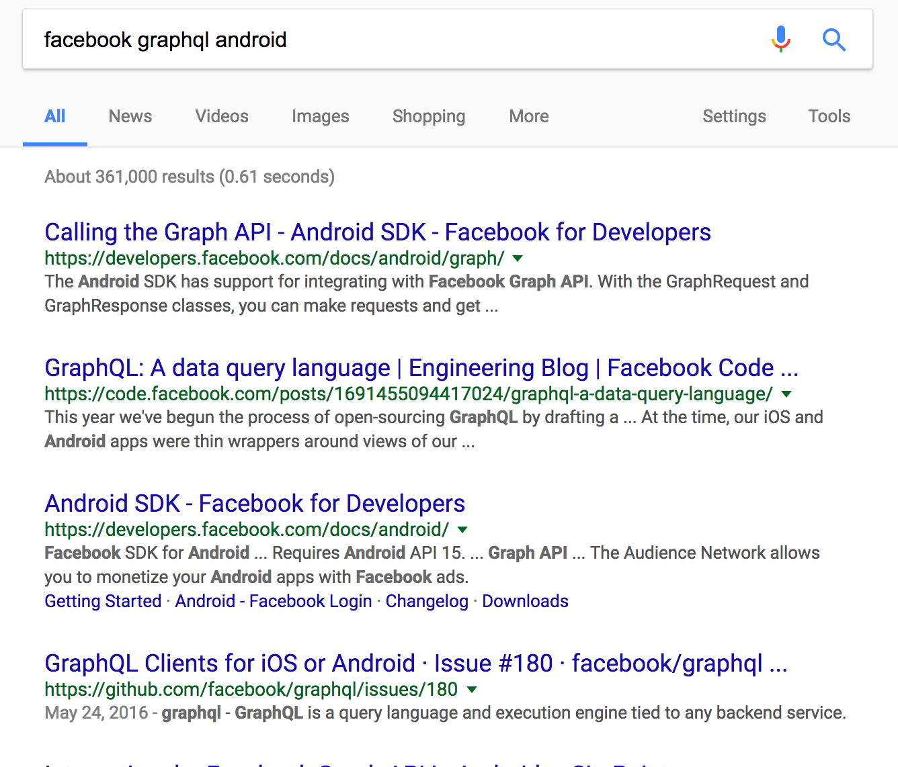
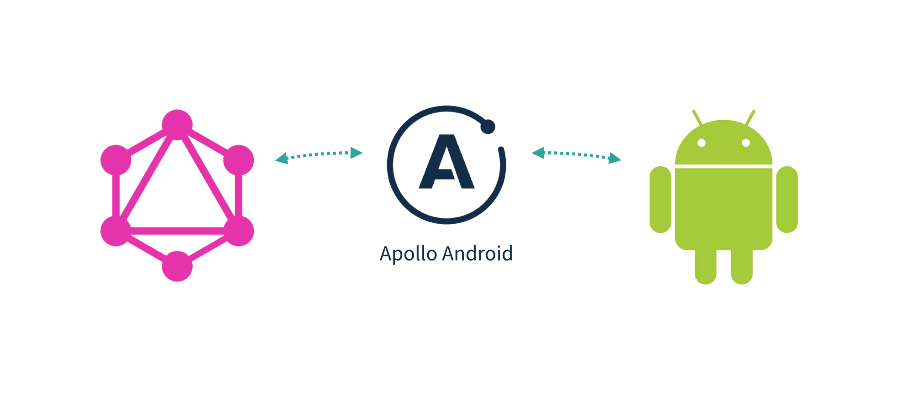

^theme:Libre white 
```javascript
Query StartTalk{ slide(id: "1") {
    Title
    Authors
    Company
   }
}
```

```javascript
{
  Title: Landing Apollo on Android,
  Authors:  [“Brian Plummer”,”Mike Nakhimovich,
  Company: New York Times
}
```
---

#We work at NYTimes
#Where we do _**a lot**_ of data loading


---
#[fit]Data loading has 
#[fit]lot of parts on Android
---
#[fit]_**Challenges**_
#Data Modeling 
#Storage: disk + mem
#Networking (retry and inflight)


---

#Open Source can mitigate challenges, different libraries fill gaps in REST data loading
#_**OKhttp | RxJava | Retrofit | Immutables| Gson | Guava | SqlDelight/Brite | Store | Curl | JsonViewer.hu**_
---

#Let's walk through typical data load from Gtihub using REST and all those great  libraries
---


#[fit]Start with Inspection

```java
 curl -i "https://api.github.com/repos/vmg/redcarpet/issues?state=closed" >> closed_issues.json
```




---
^
#Create your Value Objects with Immutables
##**Error Prone even with Code Generation**
```java

interface Issue {
    User user();
    String url();


    interface User {
        long id();
        String name();
    }
}
```

---
^
#Create your Value Objects with Immutables
##**Error Prone even with Code Generation**
```java, [.highlight: 1,6]
@Value.Immutable
interface Issue {
    User user();
    String url();

    @Value.Immutable
    interface User {
        long id();
        String name();
    }
}
```

---

^NOTE: show how poorly data is structured and how big it is/why we need reflection free parsing

#[fit] _**Parsing Json through code gen**_
```java, [.highlight: 1]
@Gson.TypeAdapters
@Value.Immutable
interface Issue {
    User user();
    String url();

    @Value.Immutable
    interface User {
        long id();
        String name();
    }
}
```

---

#[fit] Setting up Networking
```java
 open fun provideRetrofit(gson: Gson, okHttpClient: OkHttpClient): GithubApi {
        return Retrofit.Builder()
                .client(okHttpClient)
                .baseUrl(BuildConfig.BASE_URL)
                .addConverterFactory(GsonConverterFactory.create(gson))
                .addCallAdapterFactory(RxJavaCallAdapterFactory.create())
                .build()
                .create(GithubApi::class.java!!)}
```

---
#[fit]Disk Caching with SqlDelight/Brite 
^ Find example from boxbee/anchor

---
#Store
## Memory/Disk Caching with Fresh/Get
```java
StoreBuilder.parsedWithKey<SectionFrontId, BufferedSource, SectionFront>()
                .fetcher(fetcher)
                .persister(persister)
                .parser(parser)
                .memoryPolicy(MemoryPolicy
                        .builder()
                        .setMemorySize(11L)
                        .setExpireAfterWrite(TimeUnit.HOURS.toSeconds(24))
                        .setExpireAfterTimeUnit(TimeUnit.SECONDS)
                        .build())
                .networkBeforeStale()
                .open()
```

---

#Thats a good architecture
#It's also not something we can expect a beginner to know
---

#REST has problems
#[fit]Main Problem: 
#[fit]Rest was developed by our grandparents
##(It reminds me of java)
---

#GraphQL was create by Facebook as a reimagining of server/client data transfer

Give client-side developers an efficient way to query data they want to retrieve.
<br>Give server-side developers an efficient way to get their data out to their users.
<br>Give everyone an easy and efficient way of accessing data (it uses less resources than the REST API, especially with mobile applications).

---

#What’s  GraphQL?

- A query language for APIs and a runtime for fulfilling those queries with your existing data.
- Alternative for Rest-API
- Client driven - get only data you need
^Show chaining multiple queries

---
#[fit] GraphQL Basics 
###from graphql.org
---
#Graphql Example Schema 

```javascript

type Character {
  name: String!
  appearsIn: [Episode]!
}

```
---

#Graphql Example Schema 

```javascript, [.highlight: 1]

type Character {
  name: String!
  appearsIn: [Episode]!
}

```
* **Character** is a GraphQL Object Type, meaning it's a type with some fields. Most of the types in your schema will be object types.

---
#Graphql Example Schema 

```javascript, [.highlight: 2,3]

type Character {
  name: String!
  appearsIn: [Episode]!
}

```
* **name** and **appearsIn** are fields on the Character type. That means that name and appearsIn are the only fields that can appear in any part of a GraphQL query that operates on the Character type.

---

#Graphql Example Schema 

```javascript, [.highlight: 2]

type Character {
  name: String!
  appearsIn: [Episode]!
}

```
* **String** is one of the built-in scalar types - these are types that resolve to a single scalar object, and can't have sub-selections in the query.

---

#Graphql Example Schema 

```javascript, [.highlight: 2]

type Character {
  name: String!
  appearsIn: [Episode]!
}

```
* **String!** means that the field is non-nullable, meaning that the GraphQL service promises to always give you a value when you query this field.

---

#Graphql Example Schema 

```javascript, [.highlight: 3]

type Character {
  name: String!
  appearsIn: [Episode]!
}

```
* **[Episode]!** represents an array of Episode objects. Since it is also non-nullable, you can always expect an array (with zero or more items) when you query the appearsIn field.

---
#Ask for what you need, get exactly that


^top piece....is enalbled...showing query


---

#[fit] Now lets see it in Android

---
###We can't since Facebook did not open source an Android Client :disappointed:




---


###Introducing Apollo-Android GraphQL
###<BR><BR><BR><BR><BR><BR><BR><BR><BR><BR><BR><BR><BR><BR><BR><BR><BR><BR><BR><BR><BR><BR><BR><BR><BR><BR><BR><BR><BR><BR>_**Apollo Android**_ was developed by AirBnb, Shopify & New York Times as a culmination of tools, libraries, and patterns to assist in fetching data from GraphQL servers


---


#Now Let's see a demo using Apollo & Github's GraphQL API
##_**OKhttp | RxJava | Apollo-Android**_
###You Ain't Gonna Need It
#_**~~Retrofit~~ | ~~Immutables~~| ~~Gson~~ | ~~Guava~~ | ~~SqlDelight/Brite~~ | ~~Store~~ | ~~Curl~~ | ~~JsonViewer.hu~~**_
---
^Brian: Mike is a hardass and expects all the above when I code
#[fit]Demo: Same with Apollo in 5 minutes
^add apollo dep
^instantiate apollo client
^use igraphql to discover + mold your query
^add to android project
^create rxApolloQuery and subscribe to it

---

#[fit] Now for some explanations

---
#What is Apollo-Android?
##A strongly-typed, caching GraphQL client for Android
###Rich support of Types and Type Mappings
###Builders to create queries
###Query Validation at compilation 

---
#Created based on Facebook's GraphQl Spec
##Works with any Graphql Query
##Apollo Android Supports:
###Fragments
###Union Types
###Nullability
###Deprecation

---
#Apollo-Android has **2 main parts**
## **Gradle Plugin** Apollo Code Gen
###Plugin  To generate code
## **Runtime** Apollo Client
###For executing operations
---

<br><br><br><br><br><br><br><br><br>
#[fit]Using Apollo-Android
#like a boss

---
#Add Apollo dependencies
```java
build.gradle:
dependencies {
  classpath 'com.apollographql.apollo:gradle-plugin:0.4.1'
}

app/build.gradle:
apply plugin: 'com.apollographql.android'
.....
//optional RxSupport
compile 'com.apollographql.apollo:apollo-rx-support:0.4.1'
```

--- 
#Basics - Start with a query
## Queries have params and define shape of response 
```java
organization(login:”nyTimes”){
    repositories(first:6 {
           Name
    }
}
```
---

#[fit]You can explore & build queries using graphiql
##Most Graphql Servers have a GUI
^[insert] Github Explorer Demo Gif/Video

---

#Explorer shows you anything that exists in the Schema
###Nullability Rules
###Enum values
###Data Structure
###Types
---

#Fragments  = Partials, great for deduping code
##TODO Brian fill in code sample 
---
#[fit]**Add Schema & Query.graphql to project and compile**
 ---

#Apollo writes code so you don't have to make errors writing it yourself
---
#[fit]Apollo Gradle Plugin  will create for you RepoQuery.java 
#[fit]a Java representation of Request|Response|Mapper
```java

@Generated("Apollo GraphQL")
public final class RepoQuery implements Query<RepoQuery.Data, RepoQuery.Data, RepoQuery.Variables> {
  public static final String OPERATION_DEFINITION = "query Repo($name: String!) {\n"
      + "  organization(login: $name) {\n"
      + "    __typename\n"
      + "    repositories(first: 6, orderBy: {direction: DESC, field: STARGAZERS}) {\n"
      + "      __typename\n"
      + "      totalCount\n"
      + "      edges {\n"
      + "        __typename\n"
      + "        node {\n"
      + "          __typename\n"
      + "          stargazers {\n"
      + "            __typename\n"
      + "            totalCount\n"
      + "          }\n"
      + "          name\n"
      + "        }\n"
      + "      }\n"
      + "    }\n"
      + "  }\n"
      + "}";

  public static final String QUERY_DOCUMENT = OPERATION_DEFINITION;

  private static final OperationName OPERATION_NAME = new OperationName() {
    @Override
    public String name() {
      return "Repo";
    }
  };

  private final RepoQuery.Variables variables;

  public RepoQuery(@Nonnull String name) {
    Utils.checkNotNull(name, "name == null");
    variables = new RepoQuery.Variables(name);
  }
  ...
  ```


---
#MyQuery.Builder
##Builder to create your request object
```java
query = RepoQuery.builder().name("friendlyrobotnyc").build()
...

public static final class Builder {
    private @Nonnull String name;

    Builder() {
    }

    public Builder name(@Nonnull String name) {
      this.name = name;
      return this;
    }

    public RepoQuery build() {
      if (name == null) throw new IllegalStateException("name can't be null");
      return new RepoQuery(name);
    }
  }
```

---
#MyQuery.Data = Effective Java Value Object
##Apollo even generates comments from schema
```java
 public static class Repositories {
    final @Nonnull String __typename;
    final int totalCount;
    final @Nullable List<Edge> edges;
    private volatile String $toString;
    private volatile int $hashCode;
    private volatile boolean $hashCodeMemoized;

    public @Nonnull String __typename() { return this.__typename; }

    //Identifies the total count of items in the connection.
    public int totalCount() {return this.totalCount;}

    //A list of edges.
    public @Nullable List<Edge> edges() {return this.edges;}

    @Override
    public String toString() {...}

    @Override
    public boolean equals(Object o) {  ... }

    @Override
    public int hashCode() {...}
```

---
#MyQuery.Mapper
##Reflection Free parsing of a Graphql Response
```java
 public static final class Mapper implements ResponseFieldMapper<Repositories> {
      final Edge.Mapper edgeFieldMapper = new Edge.Mapper();

      @Override
      public Repositories map(ResponseReader reader) {
        final String __typename = reader.readString($responseFields[0]);
        final int totalCount = reader.readInt($responseFields[1]);
        final List<Edge> edges = reader.readList($responseFields[2], new ResponseReader.ListReader<Edge>() {
          @Override
          public Edge read(ResponseReader.ListItemReader reader) {
            return reader.readObject(new ResponseReader.ObjectReader<Edge>() {
              @Override
              public Edge read(ResponseReader reader) {
                return edgeFieldMapper.map(reader);
              }
            });
          }
        });
        return new Repositories(__typename, totalCount, edges);
      }
    }

```

###Can parse 20mb response without OOM


---
#[fit]Getting a Query Response from a Server

---

#Creating an Apollo Client
##Conventions over Configuration
```java
apolloClient= ApolloClient.builder()
                .serverUrl("https://api.github.com/graphql")
                .okHttpClient(provideOkhttp())
                .build();
```
---

#Apollo’s api is very similar to Okhttp
Stateless Apollo Client that can create an `ApolloCall`

```java
query = RepoQuery.builder().name("friendlyrobotnyc").build()

 ApolloQueryCall githubCall = apolloClient.query(query);

githubCall.enqueue(new ApolloCall.Callback<>() {
    @Override
    public void onResponse(@Nonnull Response<> response) {
        
    }

    @Override
    public void onFailure(@Nonnull ApolloException e) {

    }
});
```
---


#Nullability
##Graphql has nullable fields (show example)
##Apollo can represent as @Nullable
##Or as Optional<T> (Java, Guava, Shaded)
---
#How About Caching -  2 types
*HTTP
*Normalized

---
#Http Caching
##Similar to OKHTTP Cache but for POST requests
##Streams response to cache same time as parsing
##Can Set Cache Size
---
#Prefetch into cache
##Useful for background updates of lots of data
---
#Apollo Store - Normalized Cache
##Post Parsing
##Caches each field individually
##  Allows multiple queries to share same cached values
---
#Two implementations of Normalized Cache
##In Memory using Guava Caches (useful for rotation)
##Persistent in SqlLite
##Configurable on a per request basis
---
#Apollo Is Reactive
##QueryWatcher will emit new response when there are changes to the normalized cache records this query depends on or when mutation call occurs

---
#RxJava 1 & 2 support is built in
```java
RxApollo.from(apolloClient.query(RepoQuery.builder().name("friendlyrobotnyc").build()))
       .map(dataResponse -> dataResponse
       .data()
       .organization()
       .repositories())
       .subscribe(view::showRepositories, view::showError)
```
#RxApollo response can be transformed into LiveData
---
#Mutations
##Queries are for getting Data Mutations are for making changes on server
## Demo: Mutation
---
#Optimistic Updates
##Mutations can update data locally prior to request being sent
##If failure occurs Apollo Store will rollback changes
---
#How its Made:
##Gradle plugin with code gen written in Kotlin
##ApolloClient borrows heavily from OKHTTP (fill in details)
##ApolloCall is similar to OKhttpCall (interceptors all the way down)

---

#Why do we need Apollo Code Gen
##Generates Java Request/Response POJOs & Parsers
###<br><br>
###Written in Kotlin with :heart:

---
#Version 1.0 ships today
##380 commits
##1000s of tests
##18 contributors including devs from Shopify, Airbnb, NY Times


