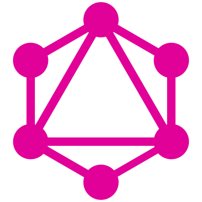
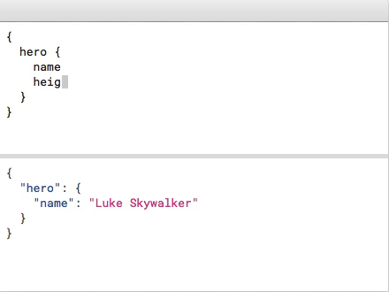
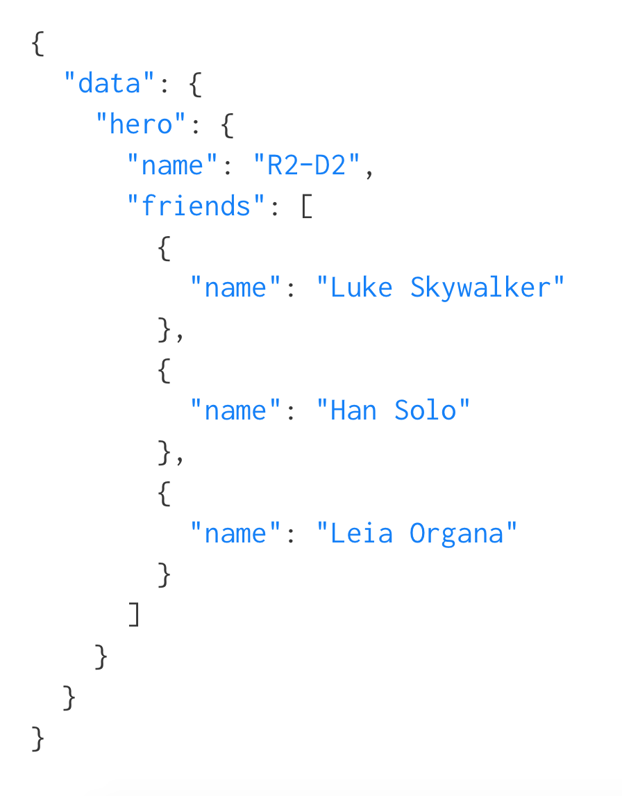
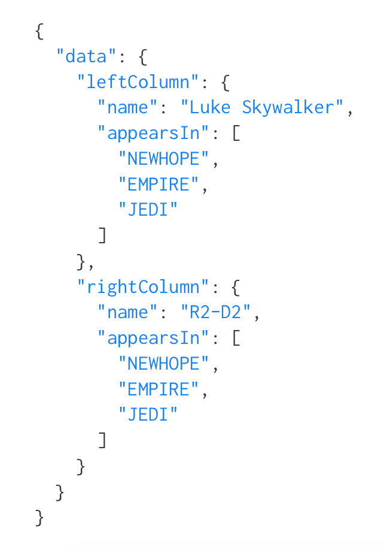

build-lists: true

```javascript
Query DroidConNYC{ slide(id: "1") 
   {
    Title
    Authors
    Company
   }
}

{
  Title: Intro to GraphQL on Android,
  Authors:  [“Brian Plummer”,”Mike Nakhimovich],
  Company: New York Times
}
```

---

#We work at NYTimes
##Where we do _**a lot**_ of data loading


---
#Recently, our team began moving from Restful APIs to instead use GraphQL
---

#Before we dive into how we did it, lets start with a primer on what graphql is and why you should care

---


#What’s  GraphQL?

- A query language for APIs and a runtime for fulfilling those queries with your existing data.
- Alternative for Rest-API
- Client driven - get only data you need
- Works on iOS, Android, Web

---

#GraphQL was created by Facebook as a reimagining of server/client data transfer

- Give front end developers an efficient way to ask for minimal data
- Give server-side developers a robust way to get their data out to their users.

---


[.build-lists: true]
#GraphQL is As Easy as 1-2-3

- Describe your data

- Ask for what you want

- Get predictable results

---

#Describe your data in a schema

```javascript

type Character {
  name: String!
  appearsIn: [Episode]!
}

```
---

#Describe your data in a schema

```javascript, [.highlight: 1]

type Character {
  name: String!
  appearsIn: [Episode]!
}

```
**Character** is a GraphQL Object Type, meaning it's a type with some fields. Most of the types in your schema will be object types.

---
#Describe your data in a schema

```javascript, [.highlight: 2,3]

type Character {
  name: String!
  appearsIn: [Episode]!
}

```
**name** and **appearsIn** are fields on the Character type. That means that name and appearsIn are the only fields that can appear in any part of a GraphQL query that operates on the Character type.

---

#Describe your data in a schema

```javascript, [.highlight: 2]

type Character {
  name: String!
  appearsIn: [Episode]!
}

```
**String** is one of the built-in scalar types - these are types that resolve to a single scalar object, and can't have sub-selections in the query.

---

#Graphql Example Schema 

```javascript, [.highlight: 2]

type Character {
  name: String!
  appearsIn: [Episode]!
}

```
**String!** means that the field is non-nullable, meaning that the GraphQL service promises to always give you a value when you query this field.

---

#Graphql Example Schema 

```javascript, [.highlight: 3]

type Character {
  name: String!
  appearsIn: [Episode]!
}

```
**[Episode]!** represents an array of Episode objects. Since it is also non-nullable, you can always expect an array (with zero or more items) when you query the appearsIn field.

---
#Ask for what you need


#get predictable results

---

#GraphQL let's you combine resources in one request

```javascript
{
  hero {
    name
    # Queries can have comments!
    friends {
      name
    }
  }
}
```


---


#GraphQL let's you combine resources in one request

```javascript
{
  hero {
    name
    # Queries can have comments!
    friends {
      name
    }
  }
}
```



---
#[fit] You can also reuse fields in a fragment

```java
{
  leftColumn: hero(episode: EMPIRE) {
    ...comparisonFields
  }
  rightColumn: hero(episode: JEDI) {
    ...comparisonFields
  }
}

fragment comparisonFields on Character {
  name
  appearsIn
}
```


---
#[fit] You can also reuse fields in a fragment


```java
{
  leftColumn: hero(episode: EMPIRE) {
    ...comparisonFields
  }
  rightColumn: hero(episode: JEDI) {
    ...comparisonFields
  }
}

fragment comparisonFields on Character {
  name
  appearsIn
}
```



---
#**Walkthrough Time!**:


#Loading data from Github using Rest vs GraphQL
---
#[fit]On Any Platform Data Loading can be broken down into
1. Model Data 
2. Network
3. Transform
4. Persist


---
#[fit] How does REST  look on Android?
---

#Like a lot of dependencies
| Data Modeling | Networking | Storage | Transform |
| --- | --- | --- | --- |
| Immutables |  OKhttp | Store | Gson|
| Curl | Retrofit | SqlDelight | RxJava |

#Yes those are all needed :joy:


---

#[fit]Start with Inspection 
#<br><br><br><br><br><br><br>
#[fit] _**curl -i "https://api.github.com/repos/vmg/redcarpet/issues?state=closed"**_ 


---
^
#Model Your Data
```java

interface Issue {
    User user();
    String url();


    interface User {
        long id();
        String name();
    }
}
```
####**Error Prone even with Code Generation**
---
^
#Data Modeling with Immutables
```java, [.highlight: 1,6]
@Value.Immutable
interface Issue {
    User user();
    String url();

    @Value.Immutable
    interface User {
        long id();
        String name();
    }
}
```
####**Error Prone even with Code Generation**

---

^NOTE: show how poorly data is structured and how big it is/why we need reflection free parsing

#[fit] Data Parsing with Gson
```java, [.highlight: 1]
@Gson.TypeAdapters
@Value.Immutable
interface Issue {
    User user();
    String url();

    @Value.Immutable
    interface User {
        long id();
        String name();
    }
}
```

---

# Networking
```java
 open fun provideRetrofit(gson: Gson, okHttpClient: OkHttpClient): GithubApi {
        return Retrofit.Builder()
                .client(okHttpClient)
                .baseUrl(BuildConfig.BASE_URL)
                .addConverterFactory(GsonConverterFactory.create(gson))
                .addCallAdapterFactory(RxJavaCallAdapterFactory.create())
                .build()
                .create(GithubApi::class.java!!)}
```

---
#Storage

```sql
CREATE TABLE issue (
    _id LONG  PRIMARY KEY AUTOINCREMENT,
    id LONG NOT NULL,
    url STRING,
    title STRING,
    comments INT NOT NULL
}
```

---
#Storage

```java
public abstract class Issue implements IssueModel {
    public static final Mapper<Issue> MAPPER =
            new Mapper<>((Mapper.Creator<Issue>) 
            ImmutableIssue::of);

    public static final class Marshal extends IssueMarshal {
    }
}
```

---
#Storage

```java
long insertIssue(Issue issue) {
        if (recordExists(Issue.TABLE_NAME, Issue.ID, String.valueOf(issue.id()))) {
            return 0;
        }

        return db.insert(Issue.TABLE_NAME, new Issue.Marshal()
                .url(issue.url())
                .id(issue.id()));
}

```

---
#Storage - Memory
```javascript
StoreBuilder.parsedWithKey<GitHubOrgId, BufferedSource, Issues>()
                .fetcher(fetcher)
                .persister(persister)
                .parser(parser)
                .memoryPolicy(MemoryPolicy
                        .builder()
                        .setMemorySize(11L)
                        .setExpireAfterWrite(TimeUnit.HOURS.toSeconds(24))
                        .setExpireAfterTimeUnit(TimeUnit.SECONDS)
                        .build())
                .networkBeforeStale()
                .open()
```

---

#[fit]Thats a good architecture
#It's also not something we can expect a beginner to know


---
#[fit]REST feels like legacy tech
##It reminds me of Java with all these great tools & hours of setup to do anything
---

#[fit] Thanks to Facebook, there's a new kid on the block
#[fit] GraphQL


---


#[fit] Now lets see GraphQL on Android

---
#_**We can't since Facebook didn't open source an Android Client :disappointed:**_


---

#_**Community to the Rescue!**_


---


###Introducing Apollo-Android GraphQL
###<BR><BR><BR><BR><BR><BR><BR><BR><BR><BR><BR><BR><BR><BR><BR><BR><BR><BR><BR><BR><BR><BR><BR><BR><BR><BR><BR><BR><BR><BR>_**Apollo Android**_ was developed by Shopify, New York Times, & AirBnb as an **Open Source** culmination of tools, libraries, and patterns to assist in fetching data from   GraphQL servers


---

#Apollo-Android
- Built by Android Devs for Android Devs
- A strongly-typed, caching GraphQL client for Android
- Rich support of Types and Type Mappings
- Code Generation for the Messy Parts
- Query Validation at compilation 

---

#Created based on Facebook's GraphQl Spec
- Works with any Graphql Query
- Fragments
- Union Types
- Nullability
- Deprecation

---

#Apollo Reduces setup to work with a backend

| Data Modeling | Networking | Storage | Transform |
| --- | --- | --- | --- |
| Github Explorer |  OKhttp | Apollo | RxJava|
| Apollo  | Apollo | Apollo |  Apollo|


###You Ain't Gonna Need It
_**~~Retrofit~~ | ~~Immutables~~| ~~Gson~~ | ~~Guava~~ | ~~SqlDelight/Brite~~ | ~~Store~~ | ~~Curl~~ | ~~JsonViewer.hu~~**_

---
#Apollo-Android has **2 main parts**
- **Gradle Plugin** Apollo Code Gen Plugin  To generate code.
- **Runtime** Apollo Client For executing operations


---
#[fit]Using Apollo-Android
#like a boss


---
#Add Apollo dependencies
```java
build.gradle:
dependencies {
  classpath 'com.apollographql.apollo:gradle-plugin:0.4.1'
}

app/build.gradle:
apply plugin: 'com.apollographql.android'
.....
//optional RxSupport
compile 'com.apollographql.apollo:apollo-rx-support:0.4.1'
```

--- 
#Create a standard GraphQL query
## Queries have params and define shape of response 
```java
organization(login:”nyTimes”){
    repositories(first:6) {
           Name
    }
}
```
---

#[fit]Leave your CURL at home
##Most Graphql Servers have a GUI
###https://developer.github.com/v4/explorer/
^[insert] Github Explorer Demo Gif/Video

---

#Explorer is for exploring schema and building queries
- Shape of Response
- Nullability Rules
- Enum values
- Types

---

#[fit]**Add Schema & RepoQuery.graphql to project & compile**
#Image needed
 ---


#Apollo writes code so you don't have to

```kotlin
 private fun CodeGenerationIR.writeJavaFiles(context: CodeGenerationContext, outputDir: File,
      outputPackageName: String?) {
    fragments.forEach {
      val typeSpec = it.toTypeSpec(context.copy())
      JavaFile.builder(context.fragmentsPackage, typeSpec).build().writeTo(outputDir)
    }

    typesUsed.supportedTypeDeclarations().forEach {
      val typeSpec = it.toTypeSpec(context.copy())
      JavaFile.builder(context.typesPackage, typeSpec).build().writeTo(outputDir)
    }

    if (context.customTypeMap.isNotEmpty()) {
      val typeSpec = CustomEnumTypeSpecBuilder(context.copy()).build()
      JavaFile.builder(context.typesPackage, typeSpec).build().writeTo(outputDir)
    }

    operations.map { OperationTypeSpecBuilder(it, fragments, context.useSemanticNaming) }
        .forEach {
          val packageName = outputPackageName ?: it.operation.filePath.formatPackageName()
          val typeSpec = it.toTypeSpec(context.copy())
          JavaFile.builder(packageName, typeSpec).build().writeTo(outputDir)
        }
  }
  ```
#[fit] Actually Ivan(sav007) does he's awesome 

---

#[fit]Builder - For Creating your request instance
```kotlin
///api
val query = RepoQuery.builder.name("nytimes").build()

//Generated Code
public static final class Builder {
    private @Nonnull String name;

    Builder() {
    }

    public Builder name(@Nonnull String name) {
      this.name = name;
      return this;
    }

    public RepoQuery build() {
      if (name == null) throw new IllegalStateException("name can't be null");
      return new RepoQuery(name);
    }
  }
```

---

#[fit]Notice how our request param `name` is validated
```kotlin, [.highlight: 18]
///api
val query = RepoQuery.builder.name("nytimes").build()

//Generated Code
public static final class Builder {
    private @Nonnull String name;

    Builder() {
    }

    public Builder name(@Nonnull String name) {
      this.name = name;
      return this;
    }

    public RepoQuery build() {
      if (name == null) throw new IllegalStateException("name can't be null");
      return new RepoQuery(name);
    }
  }
```


---
#Response Models 
```java
 public static class Repositories {
    final @Nonnull String __typename;
    final int totalCount;
    final @Nullable List<Edge> edges;
    private volatile String $toString;
    private volatile int $hashCode;
    private volatile boolean $hashCodeMemoized;

    public @Nonnull String __typename() { return this.__typename; }

    //Identifies the total count of items in the connection.
    public int totalCount() {return this.totalCount;}

    //A list of edges.
    public @Nullable List<Edge> edges() {return this.edges;}

    @Override
    public String toString() {...}

    @Override
    public boolean equals(Object o) {  ... }

    @Override
    public int hashCode() {...}
```

---
#Mapper - Reflection Free Parser
```java
 public static final class Mapper implements ResponseFieldMapper<Repositories> {
      final Edge.Mapper edgeFieldMapper = new Edge.Mapper();

      @Override
      public Repositories map(ResponseReader reader) {
        final String __typename = reader.readString($responseFields[0]);
        final int totalCount = reader.readInt($responseFields[1]);
        final List<Edge> edges = reader.readList($responseFields[2], new ResponseReader.ListReader<Edge>() {
          @Override
          public Edge read(ResponseReader.ListItemReader reader) {
            return reader.readObject(new ResponseReader.ObjectReader<Edge>() {
              @Override
              public Edge read(ResponseReader reader) {
                return edgeFieldMapper.map(reader);
              }
            });
          }
        });
        return new Repositories(__typename, totalCount, edges);
      }}

```

Can parse 20mb response without OOM

---
#[fit]Querying Github's API
#[fit]With Apollo Client
---

#Building an Apollo Client
```java
ApolloClient.builder()
                .serverUrl("https://api.github.com/graphql)
                .okHttpClient(okhttp)
                .build();
```
---
#Querying a Backend

```java, [.highlight: 1]
query = RepoQuery.builder().name("nytimes").build()

```

---
#Querying a Backend

```java, [.highlight: 3]
query = RepoQuery.builder().name("nytimes").build()

ApolloQueryCall githubCall = apolloClient.query(query);

```
---
#Querying a Backend

```java, [.highlight: 5-15]
query = RepoQuery.builder().name("nytimes").build()

ApolloQueryCall githubCall = apolloClient.query(query);

githubCall.enqueue(new ApolloCall.Callback<>() {
    @Override
    public void onResponse(@Nonnull Response<> response) {
        handleResponse(response);
    }

    @Override
    public void onFailure(@Nonnull ApolloException e) {
        handleFailure(e);
    }
});
```
---
#Apollo Handles Storage as well
---
#Storage with Apollo is done through Caches
- HTTP
- Normalized

---
#Http Caching
- Similar to OKHTTP Cache (LRU) 
- Streams response to cache same time as parsing
- Can Set Max Cache Size
- Useful for background updating to prefill cache

- Prefetching

```java
  apolloClient.prefetch(new RepoQuery("nytimes"));
```

---
#[fit]HTTP Caching is about as well as you can do in REST
#[fit] Apollo Introduces a Normalized Cache 
#[fit]Apollo Store

---
#Apollo Store
- Allows multiple queries to share same cached values
- Great for things like Master/Detail
- Caching is done Post Parsing
- Each field is Cached Individually
- Apollo ships with both an in memory and a disk implementation of an Apollo Store
- You can even use both at same time

---
#How Does Apollo Store Work?
- Each Object in Response will have its own record with ID
- All Scalars/Members will be merged together as fields
- When we are reading from Apollo, it will seamlessly read from Apollo Store or network

---

#Settings Up Bi-Level Caching with Apollo Store
```java
//Create DB
ApolloSqlHelper apolloSqlHelper = ApolloSqlHelper.create(context, "db_name");
//Create NormalizedCacheFactory
NormalizedCacheFactory normalizedCacheFactory = new LruNormalizedCacheFactory(EvictionPolicy.NO_EVICTION)
                                                    .chain(new SqlNormalizedCacheFactory(apolloSqlHelper));

```
---
#Create a Cache Key Resolver
```java

//Create the cache key resolver
 CacheKeyResolver cacheKeyResolver = new CacheKeyResolver() {
      @Nonnull @Override
      public CacheKey fromFieldRecordSet(@Nonnull ResponseField field, @Nonnull Map<String, Object> recordSet) {
        String typeName = (String) recordSet.get("__typename");
          if (recordSet.containsKey("id")) {
          String typeNameAndIDKey = recordSet.get("__typename") + "." + recordSet.get("id");
          return CacheKey.from(typeNameAndIDKey);
        }
        return CacheKey.NO_KEY;
      }

      @Nonnull @Override
      public CacheKey fromFieldArguments(@Nonnull ResponseField field, @Nonnull Operation.Variables variables) {
        return CacheKey.NO_KEY;
      }
    };
```
---
#Init Apollo Client with a cache
```java, [.highlight: 4]
//Build the Apollo Client
ApolloClient apolloClient = ApolloClient.builder()
                                    .serverUrl("/")
                                    .normalizedCache(cacheFactory, resolver)
                                    .okHttpClient(okHttpClient)
                                    .build();
```
---
#Don't like our Cache? BYO Cache
```java
public abstract class NormalizedCache {

@Nullable public abstract Record loadRecord(@Nonnull String key, @Nonnull CacheHeaders cacheHeaders)

@Nonnull public Collection<Record> loadRecords(@Nonnull Collection<String> keys, @Nonnull CacheHeaders cacheHeaders)

@Nonnull public abstract Set<String> merge(@Nonnull Record record, @Nonnull CacheHeaders cacheHeaders)

public abstract void clearAll()

public abstract boolean remove(@Nonnull CacheKey cacheKey)

```

---
#Apollo Is Reactive
##QueryWatcher will emit new response when there are changes to the normalized cache records this query depends on or when mutation call occurs

---
#Bonus: Includes RxJava Bindings
```java
RxApollo.from(apolloClient.query(RepoQuery.builder().name("nytimes").build()))
       .map(dataResponse -> dataResponse
       .data()
       .organization()
       .repositories())
       .subscribe(view::showRepositories, view::showError)
```
#RxApollo response can be transformed into LiveData

---

#Version 1.0 ships soon!
- 380 commits 
- 1000s of tests
- 18 contributors including devs from Shopify, Airbnb, NY Times

- Come join us at https://github.com/apollographql/apollo-android


