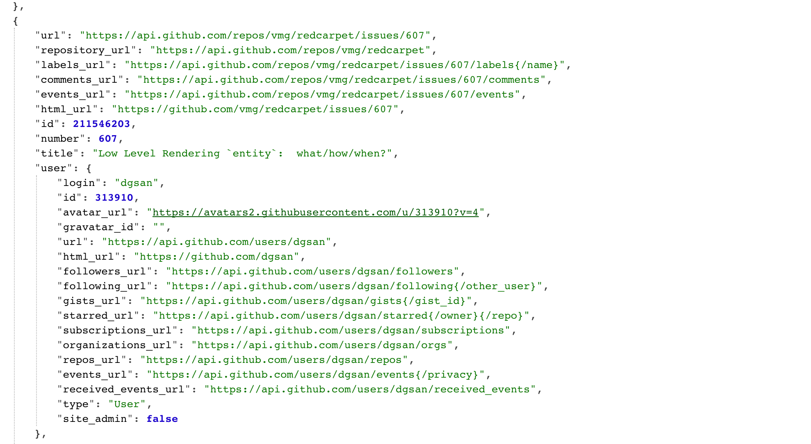

^theme:Libre white 
```javascript
Query StartTalk{ slide(id: "1") {
    Title
    Authors
    Company
   }
}
```

```javascript
{
  Title: Landing Apollo on Android,
  Authors:  [“Brian Plummer”,”Mike Nakhimovich],
  Company: New York Times
}
```
---
^insert slides of articles, sections, recipes, comments

#[fit]We work at NYTimes 
#[fit]Where we do _**a lot**_ of data loading
---
#[fit]Data loading is 
#[fit]challenging on Android
---
#[fit]_**Challenges**_
#[fit]Threading
#[fit]Caching
#[fit]Rotation
#[fit]Memory
---

#Open Source can mitigate challenges, different libraries fill gaps in REST data loading
#_**OKhttp | RxJava | Retrofit | Immutables| Gson | Guava | SqlDelight/Brite | Store | Curl | JsonViewer.hu**_
---

#Let's walk through getting Gtihub data into our app using REST and all those great  libraries
---


#[fit]_**Start with Inspection**_

```java
 curl -i "https://api.github.com/repos/vmg/redcarpet/issues?state=closed" >> closed_issues.json
```




---
^
#Create your Value Objects with Immutables
##**Error Prone even with Code Generation**
```java

interface Issue {
    User user();
    String url();


    interface User {
        long id();
        String name();
    }
}
```

---
^
#Create your Value Objects with Immutables
##**Error Prone even with Code Generation**
```java, [.highlight: 1,6]
@Value.Immutable
interface Issue {
    User user();
    String url();

    @Value.Immutable
    interface User {
        long id();
        String name();
    }
}
```

---

^NOTE: show how poorly data is structured and how big it is/why we need reflection free parsing

#[fit] _**Parsing Json through code gen**_
```java, [.highlight: 1]
@Gson.TypeAdapters
@Value.Immutable
interface Issue {
    User user();
    String url();

    @Value.Immutable
    interface User {
        long id();
        String name();
    }
}
```

---

#[fit] Setting up Networking
```java
 public GithubApi provideRetrofit(Gson gson, 
 OkHttpClient okHttpClient) {
        return new Retrofit.Builder()
                .client(okHttpClient)
                .baseUrl(BuildConfig.BASE_URL)
                .addConverterFactory(GsonConverterFactory.create(gson))
                .addCallAdapterFactory(RxJavaCallAdapterFactory.create())
                .build()
                .create(GithubApi.class);}
```

---
#[fit]Disk Caching with SqlDelight/Brite 
#[fit]Why  don't we use room? Immutability
^ Find example from boxbee/anchor

---
#Store
## In Memory Caching
## Request Routing (Fresh/Get)
## Disk Expiration Policies
---

#Thats a good architecture
#It's also not something we can expect a beginner to know
---

#REST has problems
###No control over response size (OOMs)
###Bad introspection(Curl? Plugins?)
###Lots of manual work
###Tough to load from multiple sources

---
#[fit]Main Problem: 
#[fit]Rest was developed by our grandparents
##It reminds me of java
---

#GraphQL was create by Facebook as a reimagining of server/client data transfer

Give client-side developers an efficient way to query data they want to retrieve.
<br>Give server-side developers an efficient way to get their data out to their users.
<br>Give everyone an easy and efficient way of accessing data (it uses less resources than the REST API, especially with mobile applications).

---

#What’s  GraphQL?

- A query language for APIs and a runtime for fulfilling those queries with your existing data.
- Alternative for Rest-API
- Client driven - get only data you need
^Show chaining multiple queries

---
###GraphQL is great but Facebook forgot to open source an Android Client :disappointed:


---


###GraphQL is great but Facebook forgot to open source an Android Client :disappointed:
###<BR><BR><BR><BR><BR><BR><BR><BR><BR><BR><BR><BR><BR><BR><BR><BR><BR><BR><BR><BR><BR><BR><BR><BR>_**Apollo Android**_ was developed by AirBnb, Shopify & New York Times as a culmination of tools, libraries, and patterns to assist in fetching data from GraphQL servers


---


#Let's see a demo using Apollo to hit Github's GraphQL API
##_**OKhttp | RxJava | Apollo-Android**_
###You Ain't Gonna Need It
#_**~~Retrofit~~ | ~~Immutables~~| ~~Gson~~ | ~~Guava~~ | ~~SqlDelight/Brite~~ | ~~Store~~ | ~~Curl~~ | ~~JsonViewer.hu~~**_
---
^Brian: Mike is a hardass and expects all the above when I code
#[fit]Demo: Same with Apollo in 5 minutes
^add apollo dep
^instantiate apollo client
^use igraphql to discover + mold your query
^add to android project
^create rxApolloQuery and subscribe to it

---

#[fit] Now for some explanations

---
#What is Apollo-Android?
##A strongly-typed, caching GraphQL client for Android
##Created based on Facebook's GraphQl Spec
##Convention over configuration 
---
#Apollo-Android has 2 main parts
##*Apollo Code Gen - To generate code
##*Apollo Client  - For executing requests
---

#Apollo Code Gen
##Generates Java Request/Response POJOs & Parsers
###<br><br>
###Written in Kotlin with :heart:

---
<br><br><br><br><br><br><br><br><br>
#[fit]Using Apollo-Android
#like a boss

---
#Add Apollo dependencies
--- 
#Basics - Start with a query
## Queries have params and define shape of response 
```java
   organization(login:”nyTimes”){
     repositories(first:6 {
           Name
}}
```
---

#[fit]You can explore & build queries using graphiql
##Most Graphql Servers have a GUI
^[insert] Github Explorer Demo Gif/Video

---

#Explorer shows you anything that exists in the Schema
###Nullability Rules
###Enum values
###Data Structure
###Types
---

#Fragments  = Partials 
##TODO Brian fill in code sample 
---


---

#**Add Schema & Query.graphql to your project**
###Apollo Gradle Plugin  will create for you RepoQuery.java a Java representation of Request|Response|Mapper
---

#Apollo writes code so you don't have to

---
#MyQuery.Builder
##Builder to create your request object
^show demo/example

---
#MyQuery.Data
###Value objects of your query response
###Effective Java defined “Value Object”
###All nested models you need get generated
---
#MyQuery.Mapper
##Reflection Free parsing of a Graphql Response
##No Slower than AutoValue-Moshi (show generated code)
---
#Instantiate an Apollo Client
---

# Apollo’s api is very similar to Okhttp
##Stateless Apollo Client that can create an `ApolloCall`
##Which you can enqueue/clone/cancel 
^java show example of above

---


#Nullability
##Graphql has nullable fields (show example)
##Apollo can represent as @Nullable
##Or as Optional<T> (Java, Guava, Shaded)
---
#How About Caching
*HTTP
*Normalized
---
#Http Caching
##Similar to OKHTTP Cache but for POST requests
##Streams response to cache same time as parsing
##Can Set Cache Timeouts
---
#Prefetch into cache
##Useful for background updates of lots of data
---
#Apollo Store - Normalized Cache
##Post Parsing
##Caches each field individually
##  Allows multiple queries to share same cached values
---
#Two implementations of Normalized Cache
##In Memory using Guava Caches (useful for rotation)
##Persistent in SqlLite
##Configurable on a per request basis
---
#Apollo Is Reactive
##QueryWatcher will emit new response when there are changes to the normalized cache records this query depends on or when mutation call occurs

---
#RxJava 1 & 2 support is built in
```java
RxApollo.from(ApolloManager
       .repositories())
       .map(dataResponse -> dataResponse
       .data()
       .organization()
       .repositories())
       .subscribe(view::showRepositories, view::showError)
```
#RxApollo response can be transformed into LiveData
---
#Imperative Store
##Apollo can be your database
##You can update the normalized cache yourself
---
#Mutations
##Queries are for getting Data Mutations are for making changes on server
## Demo: Mutation
---
#Optimistic Updates
##Mutations can update data locally prior to request being sent
##If failure occurs Apollo Store will rollback changes
---
#How its Made:
##Gradle plugin with code gen written in Kotlin
##ApolloClient borrows heavily from OKHTTP (fill in details)
##ApolloCall is similar to OKhttpCall (interceptors all the way down)
---
#Version 1.0 ships today
##380 commits
##1000s of tests
##18 contributors including devs from Shopify, Airbnb, NY Times


